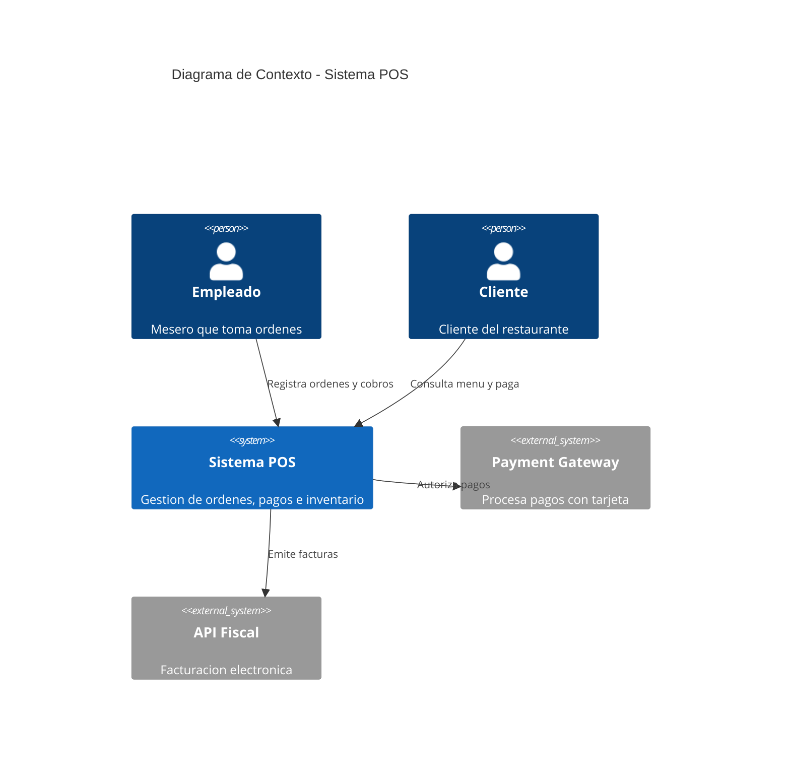
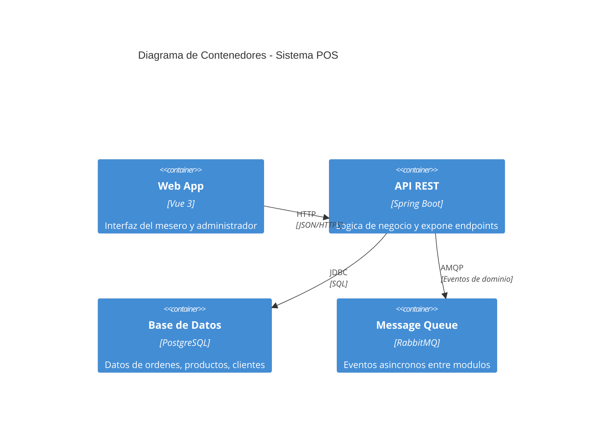
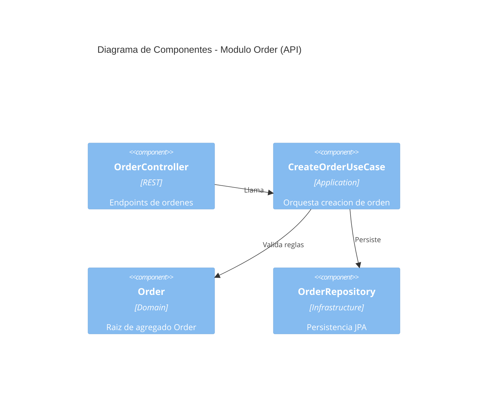
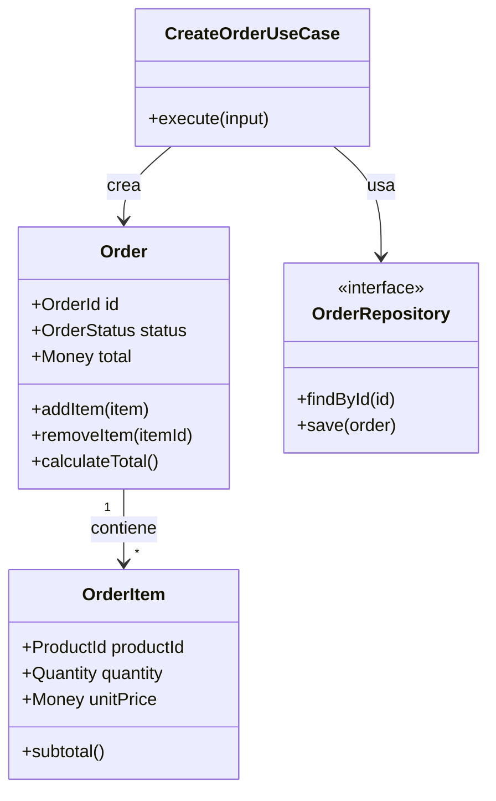

# Clean Architecture & Diseno Estructural

## Clean Architecture (Robert C. Martin)

### Circulos concéntricos

```
[ Frameworks & Drivers ]   -- outer
[ Interface Adapters   ]   |
[ Application Use Cases]   |
[ Enterprise Entities  ]   -- inner
```

- **Entidades (Enterprise Business Rules)**: Objetos de negocio fundamentales. Contienen las reglas de negocio mas esenciales y universales. Sin dependencias externas.
- **Casos de Uso (Application Business Rules)**: Orquestan el flujo de datos hacia y desde las entidades. Contienen reglas de negocio especificas de la aplicacion.
- **Adaptadores de Interfaz (Interface Adapters)**: Convierten datos entre el formato mas conveniente para casos de uso y el formato mas conveniente para agentes externos (DB, APIs, UI). Aqui viven Controllers, Presenters, Gateways, Repositories.
- **Frameworks y Drivers**: Capa mas externa. Herramientas concretas: base de datos, framework web, dispositivos.

### Regla de Dependencia

Las dependencias **siempre apuntan hacia adentro**. Ningun nombre en un circulo interior puede ser mencionado por un circulo exterior.

### Flujo de control tipico

```
Controller -> InputBoundary -> UseCaseInteractor -> Entity -> OutputBoundary -> Presenter -> ViewModel -> View
```

---

## Domain-Driven Design (Eric Evans)

### Ubiquitous Language

Lenguaje compartido entre desarrolladores y expertos de dominio. Reflejado en codigo, documentacion, conversaciones. Cada termino tiene un unico significado inequívoco.

### Entidades vs Value Objects

| Entidad | Value Object |
|---|---|
| Identidad única (ID) | Identidad por sus atributos |
| Mutable | Inmutable |
| Ej: `Order`, `Customer`, `Product` | Ej: `Money`, `Address`, `Email` |

### Agregados (Aggregates)

Cluster de objetos de dominio tratados como una unidad. Cada agregado tiene una **raiz (Aggregate Root)** que garantiza consistencia.

- `Order` es raiz de agregado que contiene `OrderItem`s.
- Solo se accede a los hijos a traves de la raiz.
- Transacciones: una transaccion = un agregado.

### Repositorios (Repository Pattern)

Abstraccion de persistencia que parece una coleccion en memoria. Solo para Aggregate Roots.

```typescript
interface OrderRepository {
  findById(id: OrderId): Order | null;
  save(order: Order): void;
  delete(id: OrderId): void;
}
```

### Eventos de Dominio

Capturan hechos del negocio que ocurrieron en el pasado. Nombre en pasado: `OrderPlaced`, `PaymentReceived`, `InventoryAdjusted`.

### Servicios de Dominio

Operaciones del dominio que no pertenecen naturalmente a una Entidad o Value Object. Sin estado, operan sobre multiples objetos de dominio.

### Factories (Domain Factory)

Encapsulan la logica de creacion de objetos complejos, asegurando invariantes.

---

## Estructura de Paquetes / Carpetas

### Por capa (arquitectura limpia canonica)

```
com.app.comida/
  domain/
    entity/
    valueobject/
    event/
    service/
    repository/       # interfaces (puertos)
  application/
    usecase/
    dto/
    port/             # interfaces de salida
  infrastructure/
    persistence/      # implementaciones repository
    messaging/
    client/
    config/
  interfaces/
    rest/
    web/
    graphql/
```

### Por feature (organica, vertical slicing)

```
com.app.comida/
  order/
    domain/
    application/
    infrastructure/
    interfaces/
  payment/
    domain/
    application/
    infrastructure/
    interfaces/
  product/
    ...
  inventory/
    ...
  shared/
    kernel/
    util/
```

**Recomendacion**: preferir **por feature** en monolitos modulares; por capa pura en proyectos con muchos equipos o microservicios.

---

## C4 Model (Simon Brown)

### Diagramas con sintaxis Mermaid

#### Nivel 1 - Contexto (Context)



#### Nivel 2 - Container (Contenedores)



#### Nivel 3 - Component (Componentes)



#### Nivel 4 - Code (Codigo)

Diagrama de clases o secuencia con Mermaid:



---

## ADRs (Architecture Decision Records)

### Formato estandar (Michael Nygard / y-STATUS)

```markdown
# ADR-{NUMERO}: {TITULO}

## Estado
[ Propuesto | Aceptado | Deprecado | Supersedido ]

## Contexto
Descripcion del problema y las fuerzas que actuan.

## Decision
La decision que se tomo y la justificacion.

## Consecuencias
- Aspectos positivos (beneficios)
- Aspectos negativos (trade-offs, costos)
- Riesgos y mitigaciones

## Alternativas Consideradas
- Alternativa A: motivo de rechazo
- Alternativa B: motivo de rechazo
```

### Donde almacenarlos

```
docs/adr/
  ADR-001-eleccion-framework-backend.md
  ADR-002-estructura-de-base-de-datos.md
  ADR-003-patron-de-comunicacion-microservicios.md
  ADR-004-formato-de-api-rest-vs-graphql.md
```

### Cuando escribir un ADR

- Cambio significativo en la arquitectura
- Eleccion de framework o tecnologia
- Decision sobre patron de diseno
- Cambio en la estructura del proyecto
- Decision sobre protocolos de comunicacion

---

## Microservicios

### Bounded Contexts (Contextos Delimitados)

Cada microservicio es un Bounded Context de DDD. Limite explicito donde un modelo de dominio es valido.

```
[Order Context]  -> [Payment Context] -> [Inventory Context] -> [Billing Context]
```

### Comunicacion

| Tipo | Protocolo | Caso de uso |
|---|---|---|
| Sincrona | REST (HTTP/JSON) | Consultas, operaciones que requieren respuesta inmediata |
| Sincrona | gRPC (HTTP/2, Protobuf) | Alta performance, streaming, contratos estrictos |
| Asincrona | Events (RabbitMQ, Kafka) | Notificaciones, desacoplamiento, escalabilidad |
| Asincrona | Message Broker (publish/subscribe) | Eventos de dominio entre contextos |

### API Gateway

Punto unico de entrada. Enruta, autentica, rate-limita, transforma.

### Saga Pattern

Transaccion distribuida a traves de multiples microservicios.

- **Coreografia**: Cada servicio publica eventos y reacciona a eventos de otros.
- **Orquestacion**: Un orquestador central coordina cada paso y maneja compensaciones.

```
Saga de CreateOrder:
  1. Order Service: Crea orden (PENDING)
  2. Payment Service: Reserva pago (COMPENSAR: liberar pago)
  3. Inventory Service: Reserva stock (COMPENSAR: devolver stock)
  4. Order Service: Marca orden como CONFIRMADA
```

### CQRS (Command Query Responsibility Segregation)

Separar comandos (escritura) de consultas (lectura). Modelos posiblemente diferentes.

```
[Command] -> CommandHandler -> WriteModel (DB normalizada)
[Query]   -> QueryHandler   -> ReadModel (DB desnormalizada, vistas)
```

Usar CQRS cuando:
- Lectura y escritura tienen cargas muy diferentes
- Consultas complejas vs escrituras simples
- Diferentes equipos mantienen lecturas vs escrituras

### Event Sourcing

Almacenar eventos de cambio como fuente de verdad. El estado actual se reconstruye reproduciendo eventos.

```
OrderCreated -> ItemAdded -> ItemAdded -> PaymentReceived -> OrderCompleted
                     |
                Estado actual (proyectado)
```

Usar Event Sourcing cuando:
- Se necesita auditoria completa
- Se requiere reconstruir estado historico
- Eventos de dominio son el core del negocio

---

## Patrones Estructurales

### Repository Pattern

Abstrae la capa de persistencia. Interfaz en dominio, implementacion en infraestructura.

### Factory Pattern

Encapsula la creacion de objetos complejos. Garantiza invariantes.

### Adapter Pattern

Convierte interfaces incompatibles. Usado en la capa de adaptadores para conectar el core con frameworks externos.

### Facade Pattern

Proporciona una interfaz simplificada a un subsistema complejo.

### Proxy Pattern

Controla el acceso a un objeto. Util para lazy loading, caching, logging, autorizacion.

---

## Documentacion Arquitectonica

- Diagramas estructurales: **Mermaid** (incrustado en Markdown)
- Decisiones arquitectonicas: **ADRs** en `docs/adr/`
- Vistas C4: archivos Markdown separados por nivel
- README arquitectonico en cada modulo/microservicio

Convencion de nomenclatura: `docs/adr/ADR-{NUMERO}-{slug}.md`

---

## Contexto del Proyecto: Sistema POS (Restaurante)

### Stack actual

- **Backend**: Spring Boot (Java) — monolitico
- **Frontend**: Vue 3 + TypeScript (a futuro)
- **Base de datos**: PostgreSQL
- **Despliegue**: On-premise o cloud (Nginx, Docker)

### Cuando considerar microservicios

- El equipo crece mas alla de 3-4 desarrolladores tocando el mismo codigo
- Modulos con ciclos de despliegue independientes (ej: inventario cambia mas rapido que pagos)
- Cuellos de botella de rendimiento localizados (ej: consultas de reporting afectan operaciones de ordenes)
- Necesidad de escalar componentes individualmente (ej: notificaciones vs API de ordenes)
- Diferentes requerimientos de persistencia (SQL + cache + busqueda textual)

### Estrategia de migracion recomendada

1. **Monolito modular**: Primero organizar por bounded contexts dentro del mismo proyecto/deploy
2. **Separacion logica**: Extraer modulos como librerias independientes con interfaces claras
3. **Extraction Pattern**: Extraer un microservicio a la vez comenzando por el mas desacoplado (ej: Payments o Notifications)
4. **Strangler Fig**: Rutear progresivamente trafico al nuevo servicio mientras el monolito sigue funcionando

### Anti-patrones a evitar

- **Microservicios prematuredos**: Sin necesidad real, agregas complejidad de red, consistencia eventual, deployment multiple
- **Dominios anemicos**: Logica de negocio en servicios en vez de entidades
- **Shared Kernel hinchado**: Demasiado codigo compartido entre servicios, perdiendo independencia
- **Orquestacion excesiva**: Sagas demasiado largas y acopladas
